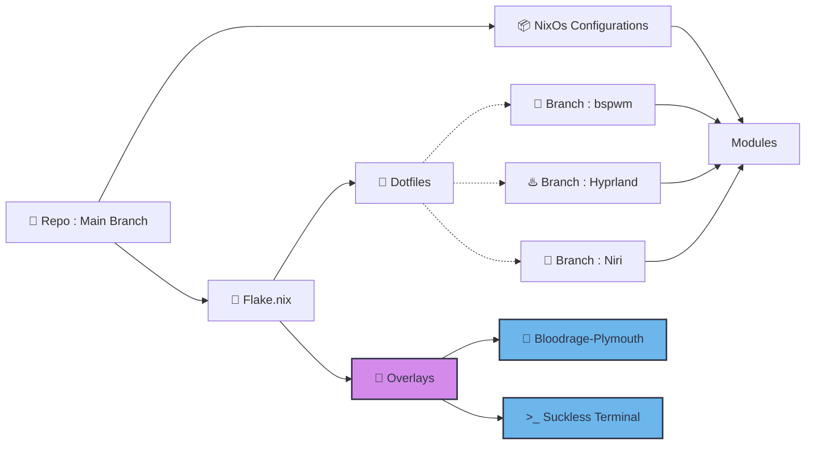

<samp>

Motivations
====

  Manajemen hidup itu penting, seperti sistem operasi, tidak seharusnya berjalan secara acak. Ia perlu dideklarasikan. NixOS mengajarkan bahwa sistem terbaik bukanlah yang paling sering diubah, melainkan yang dibangun dari konfigurasi yang jelas, sadar, dan dapat direproduksi. Tidak ada perubahan impulsif. Tidak ada dependensi tersembunyi. Tidak ada kekacauan yang tak terlacak.
  
  <h4 align="center">
    "This is not just a NixOs configs. This is a declaration of how I choose to structure chaos into order — reproducible, intentional, and versioned."
  </h4>

  

  
  Ia adalah refleksi dari filosofi hidup:  
  bahwa segala sesuatu seharusnya memiliki struktur, versi, dan arah. Seperti NixOS dengan generations dan rollback, hidup pun seharusnya memberi ruang untuk evaluasi dan perbaikan — tanpa kehilangan stabilitas. Kita tidak menghapus masa lalu; kita menyimpannya sebagai referensi untuk membangun versi yang lebih baik. Manajemen hidup adalah deklarasi nilai. Konfigurasi adalah manifestasi kesadaran. Dan stabilitas adalah hasil dari disiplin yang konsisten.

  This system is configured.
  So is the life behind it.

Structures
===

 

Linux kernel
============

The Linux kernel is the core of any Linux operating system. It manages hardware,
system resources, and provides the fundamental services for all other software.

Quick Start
-----------

* Report a bug: See Documentation/admin-guide/reporting-issues.rst
* Get the latest kernel: https://kernel.org
* Build the kernel: See Documentation/admin-guide/quickly-build-trimmed-linux.rst
* Join the community: https://lore.kernel.org/

Essential Documentation
-----------------------

All users should be familiar with:

* Building requirements: Documentation/process/changes.rst
* Code of Conduct: Documentation/process/code-of-conduct.rst
* License: See COPYING

Documentation can be built with make htmldocs or viewed online at:
https://www.kernel.org/doc/html/latest/

Who Are You?
============

Find your role below:

* New Kernel Developer - Getting started with kernel development
* Academic Researcher - Studying kernel internals and architecture
* Security Expert - Hardening and vulnerability analysis
* Backport/Maintenance Engineer - Maintaining stable kernels
* System Administrator - Configuring and troubleshooting
* Maintainer - Leading subsystems and reviewing patches
* Hardware Vendor - Writing drivers for new hardware
* Distribution Maintainer - Packaging kernels for distros

For Specific Users
==================

New Kernel Developer
--------------------

Welcome! Start your kernel development journey here:

* Getting Started: Documentation/process/development-process.rst
* Your First Patch: Documentation/process/submitting-patches.rst
* Coding Style: Documentation/process/coding-style.rst
* Build System: Documentation/kbuild/index.rst
* Development Tools: Documentation/dev-tools/index.rst
* Kernel Hacking Guide: Documentation/kernel-hacking/hacking.rst
* Core APIs: Documentation/core-api/index.rst

Academic Researcher
-------------------

Explore the kernel's architecture and internals:

* Researcher Guidelines: Documentation/process/researcher-guidelines.rst
* Memory Management: Documentation/mm/index.rst
* Scheduler: Documentation/scheduler/index.rst
* Networking Stack: Documentation/networking/index.rst
* Filesystems: Documentation/filesystems/index.rst
* RCU (Read-Copy Update): Documentation/RCU/index.rst
* Locking Primitives: Documentation/locking/index.rst
* Power Management: Documentation/power/index.rst

Security Expert
---------------

Security documentation and hardening guides:

* Security Documentation: Documentation/security/index.rst
* LSM Development: Documentation/security/lsm-development.rst
* Self Protection: Documentation/security/self-protection.rst
* Reporting Vulnerabilities: Documentation/process/security-bugs.rst
* CVE Procedures: Documentation/process/cve.rst
* Embargoed Hardware Issues: Documentation/process/embargoed-hardware-issues.rst
* Security Features: Documentation/userspace-api/seccomp_filter.rst

Backport/Maintenance Engineer
-----------------------------

Maintain and stabilize kernel versions:

* Stable Kernel Rules: Documentation/process/stable-kernel-rules.rst
* Backporting Guide: Documentation/process/backporting.rst
* Applying Patches: Documentation/process/applying-patches.rst
* Subsystem Profile: Documentation/maintainer/maintainer-entry-profile.rst
* Git for Maintainers: Documentation/maintainer/configure-git.rst

System Administrator
--------------------

Configure, tune, and troubleshoot Linux systems:

* Admin Guide: Documentation/admin-guide/index.rst
* Kernel Parameters: Documentation/admin-guide/kernel-parameters.rst
* Sysctl Tuning: Documentation/admin-guide/sysctl/index.rst
* Tracing/Debugging: Documentation/trace/index.rst
* Performance Security: Documentation/admin-guide/perf-security.rst
* Hardware Monitoring: Documentation/hwmon/index.rst

Maintainer
----------

Lead kernel subsystems and manage contributions:

* Maintainer Handbook: Documentation/maintainer/index.rst
* Pull Requests: Documentation/maintainer/pull-requests.rst
* Managing Patches: Documentation/maintainer/modifying-patches.rst
* Rebasing and Merging: Documentation/maintainer/rebasing-and-merging.rst
* Development Process: Documentation/process/maintainer-handbooks.rst
* Maintainer Entry Profile: Documentation/maintainer/maintainer-entry-profile.rst
* Git Configuration: Documentation/maintainer/configure-git.rst

Hardware Vendor
---------------

Write drivers and support new hardware:

* Driver API Guide: Documentation/driver-api/index.rst
* Driver Model: Documentation/driver-api/driver-model/driver.rst
* Device Drivers: Documentation/driver-api/infrastructure.rst
* Bus Types: Documentation/driver-api/driver-model/bus.rst
* Device Tree Bindings: Documentation/devicetree/bindings/
* Power Management: Documentation/driver-api/pm/index.rst
* DMA API: Documentation/core-api/dma-api.rst

Distribution Maintainer
-----------------------

Package and distribute the kernel:

* Stable Kernel Rules: Documentation/process/stable-kernel-rules.rst
* ABI Documentation: Documentation/ABI/README
* Kernel Configuration: Documentation/kbuild/kconfig.rst
* Module Signing: Documentation/admin-guide/module-signing.rst
* Kernel Parameters: Documentation/admin-guide/kernel-parameters.rst
* Tainted Kernels: Documentation/admin-guide/tainted-kernels.rst

Communication and Support
=========================

* Mailing Lists: https://lore.kernel.org/
* IRC: #kernelnewbies on irc.oftc.net
* Bugzilla: https://bugzilla.kernel.org/
* MAINTAINERS file: Lists subsystem maintainers and mailing lists
* Email Clients: Documentation/process/email-clients.rst
</samp>
