<samp>

# Structures

```mermaid
graph TB
%%{init: {'flowchart': {'nodeSpacing': 20, 'rankSpacing': 25}}}%%
  BSPWM["👾 Branch : bspwm"] -.- J1
  HYPRLAND["♨️ Branch : Hyprland"] -..- J1
  NIRI["🍥 Branch : Niri"] -...- J1

  J1((Ψ)) -.-> DOTS
  SUCKLESS[">_ Suckless Terminal"] -...-|Inputs| FLAKE
  PLYMOUTH["🍎 Bloodrage-Plymouth"] -..-|Inputs| FLAKE
  UNSTABLE["⚠️ Nixpkgs-Unstable"] -.-|Inputs| FLAKE
  DOTS[("🐧 Dotfiles")] -..-|Inputs| FLAKE

  FLAKE[("✨ Flake.nix")] --> OUT(("🚀")) -->|Outputs| HM["🏠︎ Home Manager"]
  OUT -->|Outputs| SYSTEMS["⚙️ NixOs Configurations"]
  OUT -->|Outputs| OVERLAYS["🛠️ Overlays"]

  SYSTEMS ---> SYSMDL["📦 Configuration.nix"]

subgraph Systems

  SYSMDL -.- SystemPackages.nix -.- Services.nix -.- Virtualisation.nix -.- Devenv.nix -.- AutoUpdate.nix -.- Hardware.nix -.- Networks.nix
  SYSMDL -.- Local.nix -.- Audio.nix -.- Users.nix -.- Bluetooth.nix -.- Acme.nix -.- FileSystems.nix -.- LCL["Hardware-configurations.nix"]
  SYSMDL -.- Fonts.nix -.- OpenSSH.nix -.- Shell.nix -.- Sudo.nix -.- Touchpad.nix -.- Settings.nix -.- Nginx.nix
  LCL -.- Networks.nix
  LCL -.- Nginx.nix
end

  classDef configNode fill:#A0C981,stroke:#303446,stroke-width:2px,color:#303446
  classDef moduleNode fill:#D48AEA,stroke:#303446,stroke-width:2px,color:#303446
  classDef appNode fill:#6CB6EB,stroke:#303446,stroke-width:2px,color:#303446
  classDef dataNode fill:#EF9F76,stroke:#303446,stroke-width:2px,color:#303446
  classDef background fill:#14141414,stroke-width:2px,color:#00ff0000
  classDef branch fill:#14141400,stroke-width:0px,color:#ffffff

  class SYSTEMS,SYSMDL, configNode
  class FLAKE,PLYMOUTH,BSPWM,HYPRLAND,NIRI,HM moduleNode
  class PLYMOUTH,SUCKLESS,OVERLAYS appNode
  class FLAKE dataNode

  class Systems background
  class J1,OUT branch
```

# Motivations

  Manajemen hidup itu penting, seperti sistem operasi, tidak seharusnya berjalan secara acak. Ia perlu dideklarasikan. NixOS mengajarkan bahwa sistem terbaik bukanlah yang paling sering diubah, melainkan yang dibangun dari konfigurasi yang jelas, sadar, dan dapat direproduksi. Tidak ada perubahan impulsif. Tidak ada dependensi tersembunyi. Tidak ada kekacauan yang tak terlacak.
  
  <h4 align="center">
    "This is not just a NixOs configs. This is a declaration of how I choose to structure chaos into order — reproducible, intentional, and versioned."
  </h4>

  
  Ia adalah refleksi dari filosofi hidup:  
  bahwa segala sesuatu seharusnya memiliki struktur, versi, dan arah. Seperti NixOS dengan generations dan rollback, hidup pun seharusnya memberi ruang untuk evaluasi dan perbaikan — tanpa kehilangan stabilitas. Kita tidak menghapus masa lalu; kita menyimpannya sebagai referensi untuk membangun versi yang lebih baik. Manajemen hidup adalah deklarasi nilai. Konfigurasi adalah manifestasi kesadaran. Dan stabilitas adalah hasil dari disiplin yang konsisten.

  This system is configured.
  So is the life behind it.

</samp>
