<samp>

    
    
     
    <!--  -->
    
     
    <h5>Environments</h5>
    

# Motivations

  Life management is essential. Like an operating system, it should not run randomly or without structure — it must be declared. NixOS teaches that the best systems are not those changed most frequently, but those built upon clear, conscious, and reproducible configurations. No impulsive modifications. No hidden dependencies. No untraceable chaos.
  
  <h4 align="center">
    "This is not merely a NixOS configuration. It is a declaration of how I choose to transform chaos into order — reproducible, intentional, and version-controlled."
  </h4>

  
  It reflects a broader philosophy of life:  
  that everything should have structure, versioning, and direction. Just as NixOS provides generations and rollback capabilities, life itself should allow room for evaluation and refinement — without sacrificing stability. We do not erase the past; we preserve it as a reference to build improved versions of ourselves. Life management is a declaration of values. Configuration is the manifestation of awareness. Stability is the outcome of consistent discipline.

  This system is configured.  
  So is the life behind it.

# Structures

```mermaid
graph TB
%%{init: {'flowchart': {'nodeSpacing': 20, 'rankSpacing': 25}}}%%
  BSPWM["👾 Branch : bspwm"] -.- J1
  HYPRLAND["♨️ Branch : Hyprland"] -..- J1
  NIRI["🍥 Branch : Niri"] -...- J1

  J1((Ψ)) -.-> DOTS
  SUCKLESS[">_ Suckless Terminal"] -...-|Inputs| FLAKE
  PLYMOUTH["🍎 Bloodrage-Plymouth"] -..-|Inputs| FLAKE
  UNSTABLE["⚠️ Nixpkgs-Unstable"] -.-|Inputs| FLAKE
  DOTS[("🐧 Dotfiles")] -..-|Inputs| FLAKE

  FLAKE[("✨ Flake.nix")] --> OUT(("🚀")) -->|Outputs| HM["🏠︎ Home Manager"]
  OUT -->|Outputs| SYSTEMS["⚙️ NixOs Configurations"]
  OUT -->|Outputs| OVERLAYS["🛠️ Overlays"]

  SYSTEMS --->|Modules| SYSMDL["📦 Configuration.nix"]

subgraph Systems

  SYSMDL -.- SystemPackages.nix -.- Services.nix -.- Virtualisation.nix -.- Devenv.nix -.- AutoUpdate.nix -.- Hardware.nix -.- Networks.nix
  SYSMDL -.- Local.nix -.- Audio.nix -.- Users.nix -.- Bluetooth.nix -.- Acme.nix -.- FileSystems.nix -.- LCL["Hardware-configurations.nix"]
  SYSMDL -.- Fonts.nix -.- OpenSSH.nix -.- Shell.nix -.- Sudo.nix -.- Touchpad.nix -.- Settings.nix -.- Nginx.nix
  LCL -.- Networks.nix
  LCL -.- Nginx.nix
end

  classDef configNode fill:#A0C981,stroke:#303446,stroke-width:2px,color:#303446
  classDef moduleNode fill:#D48AEA,stroke:#303446,stroke-width:2px,color:#303446
  classDef appNode fill:#6CB6EB,stroke:#303446,stroke-width:2px,color:#303446
  classDef dataNode fill:#EF9F76,stroke:#303446,stroke-width:2px,color:#303446
  classDef background fill:#14141414,stroke-width:2px,color:#00ff0000
  classDef branch fill:#14141400,stroke-width:0px,color:#ffffff

  class SYSTEMS,SYSMDL, configNode
  class FLAKE,PLYMOUTH,BSPWM,HYPRLAND,NIRI,HM moduleNode
  class PLYMOUTH,SUCKLESS,OVERLAYS appNode
  class FLAKE dataNode

  class Systems background
  class J1,OUT branch
```

</samp>
